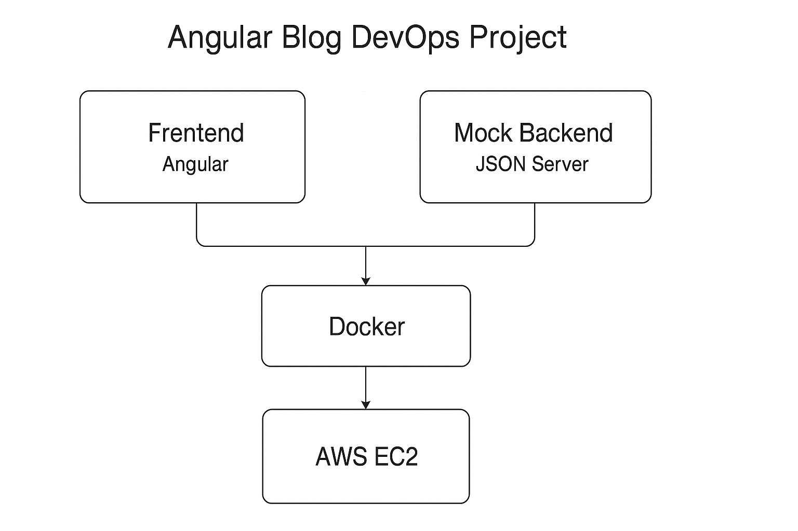
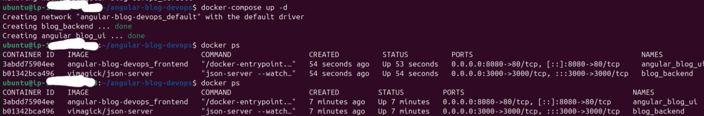
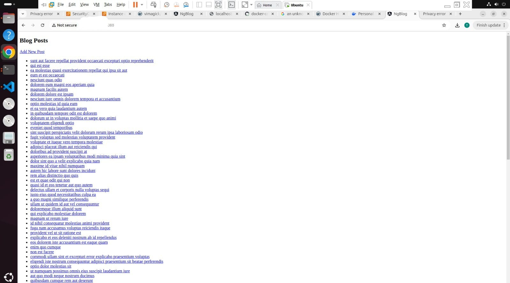
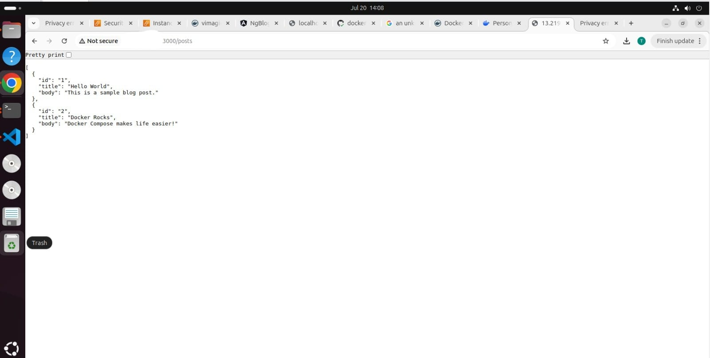
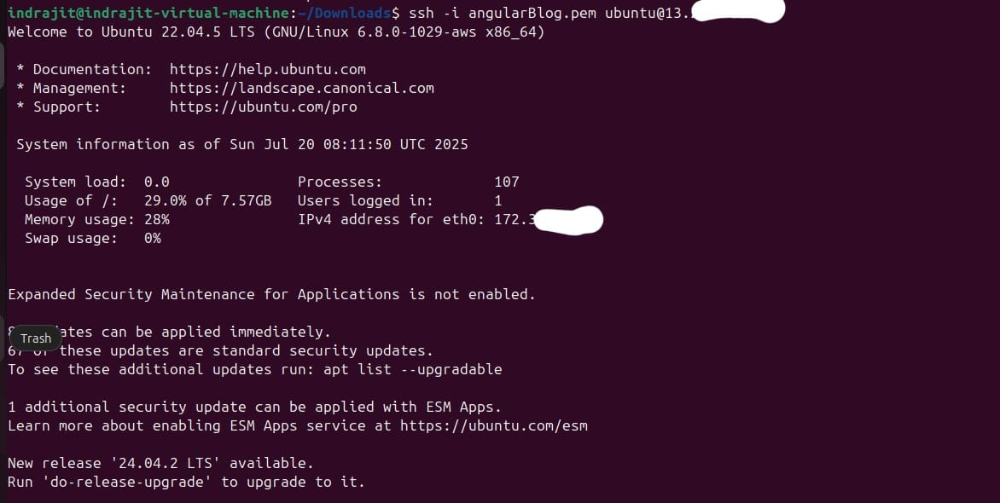

# Angular Blog DevOps Project


This project is a simple blog application built using Angular for the frontend and `json-server` for a mock backend. The main focus is to demonstrate DevOps practices such as containerization, CI/CD pipeline automation, image publishing, and cloud deployment.

---

## Features

- Angular-based blog frontend
- JSON Server as a mock backend API
- Docker-based containerization
- GitHub Actions CI/CD pipeline for automated builds and Docker image publishing
- Deployment on AWS EC2

---

## Project Structure

```

angular-blog-devops/
├── frontend/                 # Angular application
├── mock-backend/             # JSON Server with db.json
├── Dockerfile                # Dockerfile for frontend
├── docker-compose.yml        # Docker Compose setup
├── .github/workflows/        # GitHub Actions pipeline
│   └── docker-image.yml
├── ec2-setup.md              # Step-by-step EC2 deployment instructions
└── README.md

````

---

## Local Development

### Run with Docker Compose

```bash
docker-compose up --build
````

* Frontend: [http://localhost:8080](http://localhost:8080)
* Backend API: [http://localhost:3000](http://localhost:3000)

---

## CI/CD with GitHub Actions

### Workflow

* Triggered on push to the `main` branch
* Builds the Docker image
* Logs in to Docker Hub using secrets
* Pushes the image to Docker Hub repository

Workflow file location: `.github/workflows/docker-image.yml`

---

## Docker Hub

* Images are pushed to: `docker.io/indrajitruidas/angular-blog`

---

## EC2 Deployment

Deployment is done on an AWS EC2 instance using Docker and Docker Compose.

**For full step-by-step EC2 setup instructions, refer to:**
[ec2-deploy.md](./ec2-deploy.md)

---







Author
Indrajit Ruidas

GitHub: indrajitruidas1225

LinkedIn: https://www.linkedin.com/in/indrajitruidas1225

